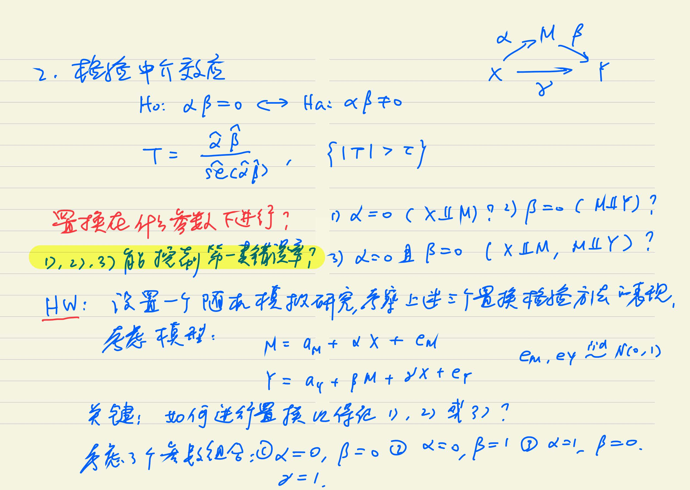

---

# Homework 1: 2022-09-09

```{r}
# clear memory
rm(list = ls())
```

## Question 1.1 (Go through "R for Beginners")

***Problem.*** Go through "R for Beginners" if you are not familiar with R programming.

***Answer.*** I've already gone through "R for Beginners" to fill the blank of my knowledge.

[Back to the Content](#top)

## Question 1.2 (Use knitr to produce several examples)

***Problem.*** Use knitr to produce at least 3 examples (texts, figures, tables).

***Answer.*** In this assignment, I will give some brief examples with the results following to show my effort on learning R programming.

### R Markdown For Texts

In R Markdown, texts can be simply written in the blank with no other symbols surrounded by, which is convinient for us students, or specifically those who major in statistics, to mark down our projects, research work and so on.

In terms of the style, we can use

- `*Italic*` or `_italic_` for italic texts, e.g. *Italic*, _italic_.
- `**Bold**` or `__bold__` for bold texts, e.g. **Bold**, __bold__.
- `***Bold Italic***` or `___bold italic___` for both italic and bold texts, e.g. ***Bold Italic***, ___bold italic___.
- `~~Strike Through~~`  for striking through the texts, e.g. ~~Strike Through~~.
- `<u>Underline</u>` for underlining the texts, e.g. <u>Underline</u>.

Note that the underline style is based on HTML/CSS style instead of Markdown itself.

Besides, we can use hyper reference in R Markdown, which is also of support in Markdown or HTML.

 - `[TEXTS](LINK)` for external links, e.g. [USTC](http://ustc.edu.cn).
 - `[TEXTS](TAGS)` for internal links, e.g. [Back to the Content](#top).

In the example below, I will focus on a problem in statistics to show we can regard R Markdown as a tool in LaTeX, with the help of 

 * `$~equation~$` for inline math equations.
 * `$$~equation~$$` for display math equations.

**Problem.** The fitted values that result from performing linear regression without an intercept. In this setting, the $i$th fitted value takes the form $$\widehat{y}_i=x_i\widehat{\beta},$$ where $\displaystyle\widehat{\beta}=\left(\sum_{i=1}^nx_iy_i\right)\Big/\left(\sum_{j=1}^nx_j^2\right)$.

### R Markdown For Figures

In R Markdown, we can use R code to generate various plots clearly.

 - 2D plot: 

```{r fig.height=4, fig.width=6, comment=""}
attach(iris)  # "iris" is a famous dataset
colnames(iris)
plot(Sepal.Length, Petal.Length)
```

 - 3D plot:

```{r fig.height=4, fig.width=6}
scatterplot3d::scatterplot3d(Sepal.Length, Sepal.Width, Petal.Length, highlight.3d = TRUE)
```

 - ggplot:

```{r fig.height=4, fig.width=6, message=FALSE}
library(ggplot2)
library(grid)
ggplot(iris, aes(Sepal.Length, Petal.Length)) +
         geom_smooth(method = "lm") +  # Use linear regression to fit the model.
         geom_point() +
         facet_wrap(~Species)  # Under different species.
```

Otherwise, we can also import figures from outside.

 - `` for offline figures.

 - `[TEXT](PATH)` for offline figures but should be clicked.

### R Markdown For Tables

On the one hand, we can use `knitr::kable()` or `xtable::xtable()` to beatify the table or print the LaTeX source code of the table.

```{r, comment = ""}
knitr::kable(head(iris), align = "l")
xtable::xtable(head(iris))
```

On the other hand, we can use Markdown table to generate our table without R code. For example, 

| Student ID | Name | Sex | Age |
| :--------: | :--: | :-: | :-: |
| SA22220001 | Zhang San | Male | 22 |
| SA22220002 | Li Si | Female | 21 |

[Back to the Content](#top)

---

# Homework 2: 2022-09-16

```{r}
# clear memory
rm(list = ls())
```

## Question 2.1 (Exercises 3.3 on Page 94)

***Problem.*** The Pareto$(a,b)$ distribution has cdf $$F(x)=1-\left(\frac{b}{x}\right)^a,\quad x\geq b>0,a>0.$$
Derive the probability inverse transformation $F^{-1}(U)$ and use the inverse transform method to simulate a random sample from the Pareto$(2,2)$ distribution. Graph the density histogram of the sample with the Pareto$(2,2)$ density superimposed for comparison.

***Solution.*** Due to the fact that if $X$ is a continuous random variable with cdf $F_X(x)$, then $$U=F_X(X)\sim U(0,1),$$
we conduct the **inverse transform algorithm** to generate random number with Pareto distribution.

It can be solved that the inverse of $F(x)$ is $$F^{-1}(x)=b(1-x)^{-1/a},\quad 0<x<1.$$
Besides, the derirative of $F(x)$ (i.e. the pdf of $X$) is $$f(x)=F'(x)=\dfrac{a\cdot b^a}{x^{a+1}},\quad x\geq b>0,a>0.$$
The algorithm is shown below.

```{r fig.height=4, fig.width=6}
set.seed(22034)
pareto <- function(a,b) {
  # Generate random numbers with cdf F(x)
  u <- runif(10000)
  x <- b*(1-u)^(-1/a)
  
  # Draw the histogram of random numbers generated
  hist(x, breaks = "scott", prob = TRUE, main = paste('Pareto(',a,',',b,')'))
  
  # Draw the density function f(x)
  y <- seq(0, max(x), 0.1)
  lines(y, a*b^a/(y^(a+1)))
}

pareto(2, 2)
```

It can be shown that the histogram of random numbers well fit the therotical density of Pareto distribution.

[Back to the Content](#top)

## Question 2.2 (Exercises 3.7 on Page 94)

***Problem.*** Write a function to generate a random sample of size $n$ from the Beta$(a,b)$ distribution by the acceptance-rejection method. Generate a random sample of size 1000 from the Beta$(3,2)$ distribution. Graph the histogram of the sample with the theoretical Beta$(3,2)$ density superimposed.

***Solution.*** Suppose $X\sim\text{Beta}(a,b)$, the density of $X$ is $$f(x)=\frac{\Gamma(a+b)}{\Gamma(a)\Gamma(b)}x^{a-1}(1-x)^{b-1},\quad 0<x<1.$$
It can be obtained that $$x_0=\underset{x\in(0,1)}{\arg\max}~f(x)=\frac{a-1}{a+b-2}.$$
Let reference density be $g(x)=\pmb 1_{\{0<x<1\}}$, then $$\frac{f(x)}{g(x)}=\frac{\Gamma(a+b)}{\Gamma(a)\Gamma(b)}x^{a-1}(1-x)^{b-1}\leq c=f(x_0).$$

Based on the **acceptance-rejection algorithm**, our algorithm is shown below:

- Generate random numbers $U\sim U(0,1)$ and $Y\sim g(\cdot)$, i.e. $Y\sim U(0,1)$;
- if $U\leq\dfrac{f(Y)}{cg(Y)}$, then accept $Y$ and return $X=Y$; otherwise reject $Y$ and continue.

***Remark.*** $f(\cdot)$ and $c$ have a common constant $\dfrac{\Gamma(a+b)}{\Gamma(a)\Gamma(b)}$, so in the algorithm, we just cancel and ignore the constant.

```{r fig.height=4, fig.width=6}
set.seed(22034)
beta <- function(a,b) {
  # Calculate constant c
  x0 <- (a-1)/(a+b-2)
  c <- x0^(a-1)*(1-x0)^(b-1)  # constant in pdf can be ignored
  
  # Generate random numbers with pdf f(x)
  n <- 1000
  k <- 0
  y <- numeric(n)
  while (k < n) {
    u <- runif(1)
    x <- runif(1) # random variate from g(x)
    if (x^(a-1)*(1-x)^(b-1) / c > u) {
      # accept x
      k <- k + 1
      y[k] <- x
    }
  }
  
  # Draw the histogram of random numbers generated
  hist(y, breaks = "scott", prob = TRUE, main = paste('Beta(',a,',',b,')'), xlab = "x")
  
  # Draw the density function f(x)
  z <- seq(0, 1, 0.01)
  lines(z, z^(a-1)*(1-z)^(b-1)*gamma(a+b)/gamma(a)/gamma(b))
}

beta(3, 2)
```

It can be shown that the histogram of random numbers well fit the therotical density of Beta distribution.

[Back to the Content](#top)

## Question 2.3 (Exercises 3.12 on Page 95)

***Problem.*** Simulate a continuous Exponential-Gamma mixture. Suppose that the rate parameter $\Lambda$ has Gamma$(r,\beta)$ distribution and $Y$ has Exp$(\Lambda)$ distribution. That is, $(Y|\Lambda=\lambda)\sim f_Y(y|\lambda)=\lambda{\rm e}^{-\lambda y}\pmb 1_{\{y\geq 0\}}$. Generate 1000 random observations from this mixture with $r=4$ and $\beta=2$.

***Solution.*** According to the mixture model, we first generate $\Lambda$ from Gamma$(r,\beta)$ distribution, then generate $Y$ from Exp$(\Lambda)$ distribution. The code is shown below.

```{r}
set.seed(22034)
expgamma <- function(r, beta) {
  # Generate random numbers from the mixture
  n <- 1000
  x <- rgamma(n, r, beta)
  y <- rexp(n, x)
  return(y)
}

r <- 4; beta <- 2
rnd <- expgamma(r, beta)
```

1000 random observations from the mixture are stored in the variable `rnd`.

[Back to the Content](#top)

## Question 2.4 (Exercises 3.13 on Page 95)

***Problem.*** It can be shown that the mixture in Exercise 3.12 has a Pareto distribution with cdf $$F(y)=1-\left(\frac{\beta}{\beta+y}\right)^r,\quad y\geq0.$$
(This is an alternative parameterization of the Pareto cdf given in Exercise 3.3.) Generate 1000 random observations from the mixture with $r=4$ and $\beta=2$. Compare the empirical and theoretical (Pareto) distributions by graphing the density histogram of the sample and superimposing the Pareto density curve.

***Solution.*** 

Given the cdf $F(y)$, the density function of $Y\sim F(y)$ is $$f(y)=\frac{r\cdot\beta^r}{(\beta+y)^{r+1}},\quad y\geq0.$$
So we can draw the histogram of random numbers we got before and the density function above.

```{r fig.height=4, fig.width=6}
# Draw the histogram of random numbers generated
hist(rnd, breaks = "scott", prob = TRUE, main = paste('Pareto(',r,',',beta,')'), xlab = "y")

# Draw the density function f(y)
y <- seq(0, max(rnd), 0.01)
lines(y, r*beta^r/(beta+y)^(r+1))
```

It can be shown that the histogram of random numbers well fit the therotical density of Pareto distribution.

***Appendix.*** Here I will give the proof of Exercise 3.13, you might go through it quickly if you are not so interested in it. Given $\Lambda\sim\Gamma(r,\beta)$, the density of $\Lambda$ is $$\pi(\lambda)=\frac{\beta^r}{\Gamma(r)}\lambda^{r-1}{\rm e}^{-\beta\lambda},\quad\lambda>0.$$

Hence, based on bayes formula, $$f(y)=\int_0^{\infty}f_Y(y|\lambda)\pi(\lambda){\rm d}\lambda=\int_0^{\infty}\frac{\beta^r}{\Gamma(r)}\lambda^{r}{\rm e}^{-\lambda(\beta+y)}{\rm d}\lambda=\frac{\beta^r}{\Gamma(r)}\cdot\frac{\Gamma(r+1)}{(\beta+y)^{r+1}}=\frac{r\cdot\beta^r}{(\beta+y)^{r+1}},\quad y\geq0.$$
Q.E.D.

[Back to the Content](#top)

---

# Homework 3: 2022-09-23

```{r}
# clear memory
rm(list = ls())
```

## Question 3.1 (QuickSort Computation Time Analysis)

***Problem.*** 

- For $n=10^4,2\times10^4,4\times10^4,6\times10^4,8\times10^4$, apply the fast sorting algorithm to randomly permuted numbers of $1,\dots,n$. 
- Calculate computation time averaged over 100 simulations, denoted by $a_n$.
- Regress $a_n$ on $t_n:=n\log n$, and graphically show the results (scatter plot and regression line).

***Solution.*** Follow the description of problem, we can run the code below.

```{r fig.height=4, fig.width=6}
quick_sort <- function(x) {
  num <- length(x)
  if (num==0 || num==1) {return(x)}
  else {
    a <- x[1]
    y <- x[-1]
    lower <- y[y<a]
    upper <- y[y>=a]
    return (c(quick_sort(lower), a, quick_sort(upper)))
  }
}

n <- c(1e4, 2e4, 4e4, 6e4, 8e4)
set.seed(22034)
an <- numeric(5)
for (i in 1:5) {
  numbers <- sample(1:n[i])
  an[i] <- mean(replicate(100, system.time(quick_sort(numbers))[1]))
}

tn <- n*log(n)
lm.fit <- lm(an ~ tn)
plot(tn, an, col='blue', pch=2)
abline(lm.fit, col='red', lwd=2)
```

From the scatter plot with regression line, we can conclude that $a_n$ is linear with $t_n=n\log n$, that is, $a_n=O(n\log n)$, which is the time complexity of quicksort algorithm.

[Back to the Content](#top)

## Question 3.2 (Exercises 5.6 on Page 150)

***Problem.*** Consider the antithetic variate approach for Monte Carlo intergration of $$\theta=\int_0^1{\rm e}^x{\rm d}x.$$
Compute ${\rm Cov}({\rm e}^U,{\rm e}^{1-U})$ and ${\rm Var}({\rm e}^U+{\rm e}^{1-U})$, where $U\sim\text{Uniform}(0,1)$. What is the percent reduction in variace of $\hat{\theta}$ that can be achieved using antithetic variates (compared with simple MC)?

***Solution.*** According to the problem, we just calculate the moment below:

\begin{align*}
&\mathbb E({\rm e}^{1-U})=\mathbb E({\rm e}^U)=\int_0^1{\rm e}^x{\rm d}x={\rm e}-1,\\
&{\rm Var}({\rm e}^{1-U})={\rm Var}({\rm e}^U)=\mathbb E({\rm e}^{2U})-[\mathbb E({\rm e}^U)]^2=\int_0^1{\rm e}^{2x}{\rm d}x-({\rm e}-1)^2=\frac{{\rm e}^2-1}{2}-({\rm e}-1)^2,\\
&{\rm Cov}({\rm e}^U,{\rm e}^{1-U})=\mathbb E({\rm e}^{U}{\rm e}^{1-U})-\mathbb E({\rm e}^U)\mathbb E({\rm e}^{1-U})={\rm e}-({\rm e}-1)^2.
\end{align*}

Hence, $${\rm Var}({\rm e}^U+{\rm e}^{1-U})={\rm Var}({\rm e}^U)+{\rm Var}({\rm e}^{1-U})+2{\rm Cov}({\rm e}^U,{\rm e}^{1-U})=-3{\rm e}^2+10{\rm e}-5.$$

- Simple MC: suppose $U$ and $V$ are i.i.d $\sim\text{Uniform}(0,1)$, the simple MC estimator of $\theta$ is $$\hat{\theta}_1=\dfrac{{\rm e}^U+{\rm e}^V}{2},$$
Its variance is $${\rm Var}(\hat{\theta}_1)={\rm Var}\Big(\dfrac{{\rm e}^U+{\rm e}^V}{2}\Big)=\frac{1}{4}\cdot2\cdot{\rm Var}({\rm e}^U)=\frac{{\rm e}^2-1}{4}-\frac{(\rm e-1)^2}{2}\approx0.1210178.$$
- Antithetic variates: suppose $U\sim\text{Uniform}(0,1)$, the antithetic estimator $\theta$ is $$\hat{\theta}_2=\dfrac{{\rm e}^U+{\rm e}^{1-U}}{2},$$
Its variance is $${\rm Var}(\hat{\theta}_2)={\rm Var}\Big(\dfrac{{\rm e}^U+{\rm e}^{1-U}}{2}\Big)=\frac{-3{\rm e}^2+10{\rm e}-5}{4}\approx0.003912497.$$

Therefore, the percentage of reduction in variance of $\hat{\theta}$ is $$\frac{{\rm Var}(\hat{\theta}_1)-{\rm Var}(\hat{\theta}_2)}{{\rm Var}(\hat{\theta}_1)}=\frac{2{\rm e}^2-6{\rm e}+2}{-{\rm e}^2+4{\rm e}-3}\approx96.76701\%.$$

[Back to the Content](#top)

## Question 3.3 (Exercises 5.7 on Page 150)

***Problem.*** Refer to Exercise 5.6. Use a Monte Carlo simulation to estimate $\theta$ by the antithetic variate approach and by the simple Monte Carlo method. Compute an empirical estimate of the percent reduction in variance using the antithetic variate. Compare the result with the theoretical value from Exercise 5.6.

***Solution.***

- Simple MC: the flowchart of algorithm is shown below.
  - Specify $m$, the number of simulations;
  - Generate random numbers $X_1,\dots,X_m$ from the uniform distribution $U(0,1)$;
  - Calculate $\displaystyle\hat{\theta}_1=\frac{1}{m}\sum_{i=1}^m{\rm e}^{X_i}$;
  - Output result $\hat{\theta}$.

```{r}
mc <- function(m) {
  x <- runif(m)
  return(mean(exp(x)))
}
```

- Antithetic variates: the flowchart of algorithm is shown below.
  - Specify an even $m$, the number of simulations;
  - Generate random number $X_1,\dots,X_{m/2}$ from the uniform distribution $U(0,1)$;
  - Calculate $\displaystyle\hat{\theta}_2=\frac{1}{m}\sum_{i=1}^{m/2}({\rm e}^{X_i}+{\rm e}^{1-X_i})$;
  - Output result $\hat{\theta}$.

```{r}
anti <- function(m) {
  x <- runif(m/2)
  y <- 1 - x
  return((mean(exp(x)) + mean(exp(y)))/2)
}
```

To calculate the variance, we should replicate the function more than once.

```{r comment=''}
iters <- 1000
m <- 10000
set.seed(22034)
theta1 <- theta2 <- numeric(iters)
for (i in 1:iters) {  # Iteration for times
  theta1[i] <- mc(m)
  theta2[i] <- anti(m)
}
thetahat1 <- mean(theta1)
thetahat2 <- mean(theta2)
c(thetahat1, thetahat2)
varhat1 <- var(theta1)
varhat2 <- var(theta2)
c(varhat1, varhat2)
(varhat1 - varhat2) / varhat1
```

The empirical estimate of the percent reduction in variance is `r (varhat1 - varhat2) / varhat1`, which is close to the theoretical value 0.9676701 from Exercise 5.6.

[Back to the Content](#top)

---

# Homework 4: 2022-09-30

```{r}
# clear memory
rm(list = ls())
```

## Question 4.1 (Exercises 5.13 on Page 151)

***Problem.*** Find two importance functions $f_1$ and $f_2$ that are supported on $(1,+\infty)$ and are 'close' to $$g(x)=\dfrac{x^2}{\sqrt{2\pi}}\text{e}^{-\frac{x^2}{2}},\quad x>1.$$
Which of your two importance functions should produce the smaller variance in estimating $$\int_1^{+\infty}\dfrac{x^2}{\sqrt{2\pi}}\text{e}^{-\frac{x^2}{2}}\text{d}x$$ by importance sampling? Explain.

***Solution.*** In order to find two 'close' density functions of $g(x)$, we first plot the function below.

```{r fig.height=4, fig.width=6}
g <- function(x) {x^2 * exp(-x^2 / 2) / sqrt(2 * pi) * (x>=1)}
plot(g, xlim = c(1, 5))
```

From the graph, we consider the truncated exponential distribution $$f_1(x)=\text{e}^{-x+1},\quad x>1.$$ and truncated normal distribution $$f_2(x)=\dfrac{2}{\sqrt{2\pi}}\text{e}^{-\frac{(x-1)^2}{2}},\quad x>1.$$
Hence, we plot them together below.

```{r fig.height=6, fig.width=6}
f1 <- function(x) {exp(1 - x) * (x>=1)}
f2 <- function(x) {2 * exp(-(x - 1)^2 / 2) / sqrt(2 * pi) * (x>=1)}
x <- seq(1, 5, 0.01)
plot(g, xlim = c(1, 5), ylim = c(0, 1), lwd = 2)
lines(x, f1(x), lty = 2, col = 2, lwd = 2)
lines(x, f2(x), lty = 3, col = 3, lwd = 2)
legend("topright", c(expression(g(x)==e^{-x^2/2}/sqrt(2*pi)),
                     expression(f1(x)==e^{-x+1}),
                     expression(f2(x)==2*e^{-(x-1)^2/2}/sqrt(2*pi))),
       inset = 0.02, lty = 1:3, col = 1:3, lwd = 2)
```

Here we validate that $f_1(x)$ and $f_2(x)$ are both density function with support $(1,+\infty)$ with the help of `integrate`.

```{r comment=''}
c(integrate(f1, 1, Inf)$value, integrate(f2, 1, Inf)$value)
```

Next, according to the **importance sampling method**, the variance of estimator $\displaystyle\hat{\theta}=\dfrac{1}{m}\sum\limits_{i=1}^m\dfrac{g(X_i)}{f(X_i)}$ is $$\text{Var}(\hat{\theta})=\frac{1}{m}\text{Var}\left(\dfrac{g(X_1)}{f(X_1)}\right),$$
where $X_1,\dots,X_m\sim f(x)$.

Therefore, we should compare $g(x)/f_1(x)$ and $g(x)/f_2(x)$, whose curves are shown below.

```{r fig.height=6, fig.width=6}
x <- seq(1, 5, 0.01)
gf1 <- g(x) / f1(x)
gf2 <- g(x) / f2(x)
plot(x, gf1, type = 'l', xlim = c(1,5), lty = 2, col = 2, lwd = 2)
lines(x, gf2, lty = 3, col = 3, lwd = 2)
legend("topright", c(expression(g(x)/f1(x)), expression(g(x)/f2(x))),
       inset = 0.02, lty = 2:3, col = 2:3, lwd = 2)
```

From the graph, it seems that the green line is closer to a constant function. Lastly, we use simulation to justify this conjecture.

```{r comment=''}
set.seed(22034)
m <- 10000
x <- rexp(m, 1) + 1
gf1 <- g(x) / f1(x)
x <- abs(rnorm(m)) + 1
gf2 <- g(x) / f2(x)
theta.hat = c(mean(gf1), mean(gf2))
var.hat = c(var(gf1), var(gf2)) / m
rbind(theta.hat, var.hat)
```

From the result above, the variance of $g(x)/f_2(x)$ is smaller than that of $g(x)/f_1(x)$, which justify our conjecture. Besides, the estimation of $\theta$ is close to the true value `r integrate(g,1,Inf)$value`.

[Back to the Content](#top)

## Question 4.2 (Exercises 5.15 on Page 151)

***Problem.*** Obtain the stratified importance sampling estimate $$\int_0^1g(x)\text{d}x=\int_0^1\frac{\text{e}^{-x}}{1+x^2}\text{d}x$$ in Example 5.13 and compare it with the result of Example 5.10.

***Solution.*** In Example 5.10, the best result was obtained with importance function $f(x)=\dfrac{\text{e}^{-x}}{1-\text{e}^{-1}},0<x<1$. First, get the result using **importance sampling method** below.

```{r comment=''}
set.seed(22034)
m <- 10000
g <- function(x) {exp(-x) / (1 + x^2) * (x>0) * (x<1)}
f <- function(x) {exp(-x) / (1 - exp(-1)) * (x>0) * (x<1)}
u <- runif(m)
x <- - log(1 - u * (1 - exp(-1))) # inverse transformation method
gf <- g(x) / f(x)
var1 <- var(gf)
c(mean(gf), var1)
```

Now divide the interval $(0,1)$ into five subintervals, $((j-1)/5,j/5)$, $j=1,\dots,5$. Then on the $j$th subinterval, variables are generated from the density $$\dfrac{5\text{e}^{-x}}{1-\text{e}^{-1}},\quad\frac{j-1}{5}<x<\frac{j}{5}.$$
Therefore, the **stratified importance sampling method** is shown below.

```{r comment=''}
set.seed(22034)
M <- 10000
k <- 5
m <- M/k
theta.hat <- var.hat <- numeric(k)
g <- function(x) {exp(-x) / (1 + x^2) * (x>0) * (x<1)}
f <- function(x) {k * exp(-x) / (1 - exp(-1)) * (x>0) * (x<1)}
for (j in 1:k) {
  u <- runif(m, (j-1)/k, j/k)
  x <- -log(1 - u * (1 - exp(-1)))
  gf <- g(x) / f(x)
  theta.hat[j] <- mean(gf)
  var.hat[j] <- var(gf)
}
var2 <- sum(var.hat) # the variance of theta is sum of the variance of each stratum
c(sum(theta.hat), var2)
```

From the result above, we can see that the estimation of $\theta$ is still close to the true value `r integrate(g, 0, 1)$value`, but the variance is reduced by $$\frac{`r var1`-`r var2`}{`r var1`}=`r (var1-var2)/var1`,$$ or equivalently 99.05\%.

[Back to the Content](#top)

---

# Homework 5: 2022-10-09

```{r}
# clear memory
rm(list = ls())
```

## Quesiton 5.1 (Exercises 6.4 on Page 180)

***Problem.*** Suppose that $X_1,\dots,X_n$ are a random sample from a lognormal distribution with unknown parameters. Construct a 95\% confidence interval for the parameter $\mu$. Use a Monte Carlo method to obtain an empirical estimate of the confidence level.

***Solution.*** A random variable $X\sim\text{LogNormal}(\mu,\sigma^2)$ means $\ln X\sim N(\mu,\sigma^2)$, and the density of $X$ is $$f(x;\mu,\sigma^2)=\frac{1}{x\sqrt{2\pi}\sigma}\exp\left\{-\dfrac{(\ln x-\mu)^2}{2\sigma^2}\right\},\quad x>0.$$
Hence, the expectation of $\ln X$ would be $\mathbb E(\ln X)=\mu$, and the variance of it would be $\text{Var}(\ln X)=\sigma^2$. Given the sample $X_1,\dots,X_n$, the estimation of $\mu$ and $\sigma^2$ will be $$\hat{\mu}=\frac{1}{n}\sum_{i=1}^n\ln X_i,\quad\hat{\sigma}^2=\frac{1}{n-1}\sum_{i=1}^n(\ln X_i-\hat{\mu})^2.$$
Due to the fact that $\dfrac{\ln X-\mu}{\hat{\sigma}/\sqrt{n}}\sim t(n-1)$, the 95\% confidence interval for the parameter $\mu$ is $$\left[\hat{\mu}+\frac{\hat{\sigma}}{\sqrt{n}}t_{0.025}(n-1),\hat{\mu}+\frac{\hat{\sigma}}{\sqrt{n}}t_{0.975}(n-1)\right],$$
where $t_\alpha(n-1)$ is $\alpha$-quantile of $t$ distribution with degree $n-1$.

```{r comment=''}
# clear memory, set seed, and initialize sample size
rm(list = ls())
set.seed(22034)
n <- 100

# construct confidence interval
CI_t <- function(n) {
  # generate data
  x <- rlnorm(n)
  y <- log(x)
  
  # calculate the estimation of parameter
  mu.hat <- mean(y)
  sigma.hat <- sd(y)
  
  # calculate confidence interval (note we construct CI with t distribution)
  result <- mu.hat + sigma.hat / sqrt(n) * qt(c(0.025, 0.975), n - 1) 
  return(result)
}

# replicate the function
m <- 10000
MC.CI <- matrix(nrow = m, ncol = 2)
for (i in 1:m) { MC.CI[i,] <- CI_t(n) }
mean(MC.CI[,1] < 0 & MC.CI[,2] > 0)
```

The coverage probability of the confidence interval is `r mean(MC.CI[,1] < 0 & MC.CI[,2] > 0)`, which is conservative.

[Back to the Content](#top)

## Quesiton 5.2 (Exercises 6.8 on Page 181)

***Problem.*** Repeat the Count Five test power simulation in Example 6.16, but also compute the $F$ test of equal variance, at significance level $\hat{\alpha}\approx0.055$. Compare the power of the Count Five test and $F$ test for small, medium, and large sample sizes. (Recall that the $F$ test is not applicable for non-normal distributions.)

***Solution.*** The *two sample "Count Five" test* for equality of variance counts the number of extreme points of each sample relative to the range of the other sample.

- Suppose the means of the two samples are equal and the sample sizes are equal.
- An observation in one sample is considered extreme if it's not within the range of the other sample.
- If either sample has five or more extreme points, the hypothesis of equal variance is rejected.

Let $X$ and $Y$ denote the two populations with same means $0$, the hypothesis test problem is $$H_0:\sigma_X^2=\sigma_Y^2\longleftrightarrow H_a:\sigma_X^2\neq\sigma_Y^2.$$
In Example 6.16, $X\sim N(0,1)$, $Y\sim N(0,1.5^2)$, and the sample sizes are $n_X=n_Y=20$. The `count5test` function is copied from Example 6.14.

```{r}
# clear memory, and set seed
rm(list = ls())
set.seed(22034)

# Count Five Test
count5test <- function(x, y) {
  X <- x - mean(x)
  Y <- y - mean(y)
  outX <- sum(X > max(Y)) + sum(X < min(Y)) # extreme obsevations of X to Y
  outY <- sum(Y > max(X)) + sum(Y < min(X)) # extreme obsevations of Y to X
  return(as.integer(max(c(outX, outY)) > 5)) # 1 for rejecting the null hypothesis
}
```

And we can conduct the $F$ test with function `var.test`. Hence, we do the experiment below.

```{r}
# intitialize
n_test <- c(10, 20, 50, 100, 200, 500) # number of sample size
m <- 1000 # numebr of iterations
sigmaX <- 1
sigmaY <- 1.5

# conduct the experiment
result <- matrix(nrow = 6, ncol = 3)
for (n in n_test) {
  result_n <- matrix(nrow = m, ncol = 2)
  for (i in 1:m) {
    # generate data 
    x <- rnorm(n, 0, sigmaX)
    y <- rnorm(n, 0, sigmaY)
    
    # conduct the two test
    count5test.res <- count5test(x, y)
    Ftest.res <- as.integer(var.test(x, y)$p.value <= 0.055)
    
    # save the result
    result_n[i,] <- c(count5test.res, Ftest.res)
  }
  result[which(n_test == n),] <- c(n, apply(result_n, 2, mean))
}
```

The result of comparison is saved in variable `result`, where the first line is the sample size, the second line is the power of Count Five test, the last line is the power of $F$ test. Here is the result.

```{r comment=''}
print(result)
```

From the result above, we draw to the conclusion that $F$ test is more powerful than Count Five test in this problem, because the number in the last line is always larger than it in the second line with same sample size.

[Back to the Content](#top)

## Quesiton 5.3 (Discussion in Beamer)

***Problem.*** If we obtain the powers for two methods under a particular simulation setting with 10,000 experiments: say, 0.651 for one method and 0.676 for another method. Can we say the powers are different at 0.05 level?

- What is the corresponding hypothesis test problem?
- Which test can we use? $Z$-test, two-sample $t$-test, paired $t$-test or McNemar test? Why?
- Please provide the least necessary information for hypothesis testing.

***Solution.*** Let $P^{(1)}$ and $P^{(2)}$ denote the two powers for two methods, respectively. The hypothesis test problem would be $$H_0:P^{(1)}=P^{(2)}\longleftrightarrow H_a:P^{(1)}\neq P^{(2)}.$$

**Case 1:** If we can replicate the experiments, we will get the sample $P^{(1)}_1,\dots,P^{(1)}_m$ and $P^{(2)}_1,\dots,P^{(2)}_m$. Then we should use two-sample $t$-test. The reasons are below.

- There are two samples, which means we can't use $Z$-test (it's for single sample testing).
- The powers are simulated from two different method, which means we can't use paired $t$-test.
- The powers are continuous, which means we can't use McNemar test (it's for nominal testing).

Here are the details of two-sample $t$-test in this problem setting.

1. Clear the memory, set random seed and initialize.
2. Replicate for $m$ times under two different methods and get the samples $P^{(1)}_1,\dots,P^{(1)}_m$ and $P^{(2)}_1,\dots,P^{(2)}_m$.
3. Conduct two-sample $t$-test with the R code `t.test(P1, P2, alternative = "two.sided")`.
4. If p-value $<0.05$ then we say the powers are different at 0.05 level.

**Case 2:** Otherwise, we should use McNemar test because we have only one observation, which is paired nominal data. Therefore, we can contruct the $2\times2$ table for McNemar test below.

| | Test1 Reject | Test1 Accept | Row Sum |
| :-: | :-: | :-: | :-: |
| **Test2 Reject** | $a$ | $b$ | $a+b$ |
| **Test2 Accept** | $c$ | $d$ | $c+d$ |
| **Column Sum** | $a+c$ | $b+d$ | $a+b+c+d$ |

In this problem, $a+c=6510$, $a+b=6760$ and $a+b+c+d=10000$. Then we can conduct McNemar test with the R code `mcnemar.test(matrix(c(a, c, b, d), nrow = 2))`. If p-value $<0.05$ then we say the powers are different at 0.05 level.

[Back to the Content](#top)

---

# Homework 6: 2022-10-14

```{r}
# clear memory
rm(list = ls())
```

## Question 6.1 (Exercises 7.4 on Page 212)

***Problem.*** Refer to the air-conditioning data set `aircondit` provided in the `boot` package. The 12 observations are the times in hours between failures of air-conditioning equipment [63, Example 1.1]: 

$$3, 5, 7, 18, 43, 85, 91, 98, 100, 130, 230, 487.$$

Assume that the times between failures follow an exponential model Exp($\lambda$). Obtain the MLE of the hazard rate $\lambda$ and use bootstrap to estimate the bias and standard error of the estimate.

***Solution.*** Let $\pmb X=(X_1,\dots,X_n)$ denote the i.i.d. sample from the population $X\sim\text{Exp}(\lambda)$, the density of which is $$f(\pmb x)=\prod_{i=1}^nf(x_i)=\lambda^n\exp\left\{-\lambda\sum_{i=1}^nx_i\right\},\quad x_i>0,i=1,\dots,n.$$

Thus the log-likelihood of $\lambda$ is $$\ell(\lambda)=n\ln\lambda-\lambda\sum_{i=1}^nx_i,\quad\lambda>0.$$
Setting the derivative equal to 0 derives the MLE of $\lambda$ be $$\dfrac{\partial\ell(\lambda)}{\partial\lambda}=\dfrac{n}{\lambda}-\sum_{i=1}^nx_i=0~\Rightarrow~\hat{\lambda}_{\text{MLE}}(\pmb x)=\left(\frac{1}{n}\sum_{i=1}^nx_i\right)^{-1}=\dfrac{1}{\overline{x}},$$
where $\displaystyle\overline{x}=\dfrac{1}{n}\sum_{i=1}^nx_i$.

The flowchart of bootstrap algorithm is as follows:

- Original sample $x_1,\dots,x_n$, and estimator of parameter $\hat{\lambda}=1/\overline{x}$.
- Set $B$ and random seed. For $b$th bootstrap ($b=1,\dots,B$)：
  - Generate sample $\pmb x_{(b)}^*=\{x_{(b1)}^*,\dots,x_{(bn)}^*\}$ by sampling with replacement from the original sample $x_1,\dots,x_n$;
  - Compute the $b$th replicate $\hat{\lambda}_{(b)}^*=1/\overline{x}_{(b)}^*$ using the $b$th bootstrap sample.
- Compute bootstrap estimator $\displaystyle\hat{\lambda}^*=\dfrac{1}{B}\sum_{b=1}^B\hat{\lambda}_{(b)}^*$, and its standard error $\displaystyle\sqrt{\dfrac{1}{B-1}\sum_{b=1}^B(\hat{\lambda}_{(b)}^*-\hat{\lambda}^*)^2}$.

```{r comment=''}
# clear memory, import package, and attach dataset
rm(list = ls())
library(boot)
xsample <- aircondit$hours

# Bootstrap
set.seed(22034)
B <- 10000
lambda <- 1 / mean(xsample)
lambda.star <- numeric(B)
for (b in 1:B) {
  xstar <- sample(xsample, replace = TRUE)
  lambda.star[b] <- 1 / mean(xstar)
}

# reuslt
round(c(lambda = lambda,
        lambda.star = mean(lambda.star),
        bias = mean(lambda.star) - lambda,
        se.boot = sd(lambda.star)), 4)
```
From the result above, the estimated bias is `r round(mean(lambda.star) - lambda, 4)` and standard error of the estimate is `r round(sd(lambda.star), 4)`.

```{r comment=''}
# Bootstrap with the package boot
set.seed(22034)
hazard_rate <- function(x, i) { 1 / mean(x[i]) }
boot.res <- boot(xsample, statistic = hazard_rate, R = 10000)

# result_standard
round(c(original = boot.res$t0,
        bias = mean(boot.res$t) - boot.res$t0,
        se.boot = sd(boot.res$t)), 4)
```

The result from the standard package `boot` is same to our result.

[Back to the Content](#top)

## Question 6.2 (Exercises 7.5 on Page 212)

***Problem.*** Refer to Exercise 7.4. Compute 95\% bootstrap confidence intervals for the mean time between failures $1/\lambda$ by the standard normal, basic, percentile, and BCa methods. Compare the intervals and explain why they may differ.

***Solution.*** First, do the same process with Exercise 7.4 but with different statistics.

```{r comment=''}
# Bootstrap
set.seed(22034)
B <- 10000
meantime <- mean(xsample)
meantime.star <- numeric(B)
for (b in 1:B) {
  xstar <- sample(xsample, replace = TRUE)
  meantime.star[b] <- mean(xstar)
}

# reuslt
round(c(meantime = meantime,
        meantime.star = mean(meantime.star),
        bias = mean(meantime.star) - meantime,
        se.boot = sd(meantime.star)), 4)
```

Next, calculate four different confidence intervals.

1. Standard normal CI: $(\hat{\theta}-u_{\alpha/2}\hat{\text{se}}(\hat{\theta}^*),\hat{\theta}+u_{\alpha/2}\hat{\text{se}}(\hat{\theta}^*))$.

```{r comment=''}
CI.std <- meantime + qnorm(c(0.025, 0.975)) * sd(meantime.star)
```

2. Basic CI: $(2\hat{\theta}-\hat{\theta}_{1-\alpha/2}^*,2\hat{\theta}-\hat{\theta}_{\alpha/2}^*)$.

```{r comment=''}
CI.basic <- 2 * meantime - unname(quantile(meantime.star, c(0.975, 0.025)))
```

3. Percentile CI: $(\hat{\theta}_{\alpha/2}^*,\hat{\theta}_{1-\alpha/2}^*)$.

```{r comment=''}
CI.perc <- unname(quantile(meantime.star, c(0.025, 0.975)))
```

4. BCa CI: $(\hat{\theta}_{\alpha_1}^*,\hat{\theta}_{\alpha_2}^*)$, where $\alpha_1$ and $\alpha_2$ are modification of the percentile above (see details in R code).

```{r comment=''}
# the bias correction factor
z0 <- qnorm(sum(meantime.star < meantime) / B)

# the acceleratiom factor (jackknife est.)
meantime.jack <- numeric(B)
for (i in 1:B) {
  meantime.jack[i] <- mean(xsample[-i])
}
L <- mean(meantime.jack) - meantime.jack
a <- sum(L^3) / (6 * sum(L^2)^1.5)

# BCa conf. limits
alpha <- c(0.025, 0.975)
zalpha <- qnorm(alpha)
adj.alpha <- pnorm(z0 + (z0 + zalpha) / (1 - a * (z0 + zalpha)))
CI.BCa <- unname(quantile(meantime.star, adj.alpha))
```

We combine the four CIs in the result below.

```{r comment=''}
rbind(CI.std, CI.basic, CI.perc, CI.BCa)
```

Next, we use the standard function `boot.ci` to compute four CIs so as to compare our results with the reference.

```{r}
# Bootstrap with the package boot
set.seed(22034)
mean_time <- function(x, i) { mean(x[i]) }
boot.res <- boot(xsample, statistic = mean_time, R = 10000)
boot.ci(boot.res, type = c("norm", "basic", "perc", "bca"))
```

The two results are approximately the same. Finally, we explain why they differ.

```{r fig.height=4, fig.width=6}
hist(boot.res$t, breaks = "scott", prob = TRUE)
abline(v = boot.res$t0, col = 'red', lwd = 2)
```

From the density histogram, the replicates are not normal, and are right-skewed. Therefore, the standard normal CI differs from the percentile CI, so the basic CI is. Besides, BCa adjust the skewness and bias.

[Back to the Content](#top)

## Question 6.3 (Projects 7.A on Page 213)

***Problem.*** Conduct a Monte Carlo study to estimate the coverage probabilities of the standard normal bootstrap confidence interval, the basic bootstrap confidence interval, and the percentile confidence interval. Sample from a normal population and check the empirical coverage rates for the sample mean. Find the proportion of times that the confidence intervals miss on the left, and the proportion of times that the confidence intervals miss on the right.

***Solution.*** 

```{r comment=''}
# clear memory, import package, and set seed
rm(list = ls())
library(boot)
set.seed(22034)

# Bootstrap
m <- 1000
mu <- 1
boot.mean <- function(x, i) { mean(x[i]) }
CI.norm <- CI.basic <- CI.perc <- matrix(nrow = m, ncol = 2)
for (i in 1:m) {
  xsample <- rnorm(100, mu, 1)
  res <- boot(data = xsample, statistic = boot.mean, R = 1000)
  ci <- boot.ci(res, type = c("norm", "basic", "perc"))
  CI.norm[i,] <- ci$norm[2:3]
  CI.basic[i,] <- ci$basic[4:5]
  CI.perc[i,] <- ci$perc[4:5]
}

# result
coverage_rate <- c(norm = mean(CI.norm[, 1] <= mu & CI.norm[, 2] >= mu),
                   basic = mean(CI.basic[, 1] <= mu & CI.basic[, 2] >= mu),
                   perc = mean(CI.perc[, 1] <= mu & CI.perc[, 2] >= mu))
miss_left <- c(mean(CI.norm[, 1] > mu), mean(CI.basic[, 1] > mu), mean(CI.perc[, 1] > mu))
miss_right <- c(mean(CI.norm[, 2] < mu), mean(CI.basic[, 2] < mu), mean(CI.perc[, 2] < mu))
rbind(coverage_rate, miss_left, miss_right)
```

The coverage probability is close to 95\% and the proportion of times that the confidence intervals miss on the left is bigger than the proportion of times that the confidence intervals miss on the right, always.

[Back to the Content](#top)

---

# Homework 7: 2022-10-21

```{r}
# clear memory
rm(list = ls())
```

## Question 7.1 (Exercises 7.8 on Page 213)

***Problem.*** Efron and Tibshirani discuss the `scor (bootstrap)` test score data on 88 students who took examinations in five subjects. Each row of the data frame is a set of scores $(x_{i1},\dots,x_{i5})$ for the $i^{\text{th}}$ student. The five-dimensional scores data have a $5\times 5$ covariance matrix $\Sigma$, with positive eigenvalues $\lambda_1>\cdots>\lambda_5$. In principal components analysis, $$\theta=\dfrac{\lambda_1}{\sum_{j=1}^5\lambda_j}$$ measures the proportion of variance explained by the first principal component. Let $\hat{\lambda}_1>\cdots>\hat{\lambda}_5$ be the eigenvalues of $\hat{\Sigma}$, where $\hat{\Sigma}$ is the MLE of $\Sigma$. Obtain the jackknife estimates of bias and standard error of $\hat{\theta}=\dfrac{\hat{\lambda}_1}{\sum_{j=1}^5\hat{\lambda}_j}$.

***Solution.*** The jackknife algorithm is same to leave-one-out algorithm, so we implement the process below.

- Attach dataset, markdown the sample size $n$, and compute the estimator $\hat{\theta}(\pmb x)$.
- For $i=1,\dots,n$, ignore the $i^\text{th}$ sample and compute the estimator $\hat{\theta}(\pmb x_{(i)})$.
- Compute the jackknife esimator $\hat{\theta}_{\text{jack}}=\dfrac{1}{n}\sum\limits_{i=1}^n\hat{\theta}(\pmb x_{(i)})$.
- Compute the bias $(n-1)(\hat{\theta}_{\text{jack}}-\hat{\theta}(\pmb x))$ and standard error $\sqrt{\dfrac{n-1}{n}\sum\limits_{i=1}^n(\hat{\theta}(\pmb x_{(i)})-\hat{\theta}_{\text{jack}})^2}$.

```{r comment=''}
# clear memory, import package, and set seed
rm(list = ls())
library(bootstrap)
set.seed(22034)

# attach the dataset
attach(scor)
x <- data.frame(scor)
detach(scor)
n <- nrow(x)

# jackknife
theta.jack <- numeric(n)
lambda <- eigen(cov(x))$values
theta.hat <- max(lambda) / sum(lambda)
for (i in 1:n) {
  y <- x[-i,]
  lambda.jack <- eigen(cov(y))$values
  theta.jack[i] <- max(lambda.jack) / sum(lambda.jack)
}

# result
theta.jack.mean <- mean(theta.jack)
bias <- (n - 1) * (theta.jack.mean - theta.hat)
se.jack <- sqrt((n - 1) * mean((theta.jack - theta.jack.mean)^2))
c(theta.hat = theta.hat, theta.jack = theta.jack.mean, bias = bias, se.jack = se.jack)
```

From the result above, the jackkinfe estimate bias is very small, and the estimate standard error is `r round(se.jack, 4)`.

[Back to the Content](#top)

## Question 7.2 (Exercises 7.11 on Page 213)

***Problem.*** In Example 7.18, leave-one-out ($n$-fold) cross validation was used to select the best fitting model. Use leave-two-out cross validation to compare the models.

***Solution.*** For leave-two-out cross validation, we implement the process below.

- Attach dataset, markdown the sample size $n$.
- Generate 4 containtors lengthed $\binom{n}{2}$ for storing mse result.
- For $i=1,\dots,n-1$, $j=i+1,\dots,n$,
  - Ignore the $i^\text{th}$ and $j^\text{th}$ sample, the fit the model with samples $\pmb x_{(ij)}$;
  - Compute the validation error with these two samples and store.
- Calculate the mean error and select the best fitting model.

```{r comment='', message=F}
# clear memory, set seed, and import package
rm(list = ls())
set.seed(22034)
library(DAAG)

# attach the data set
attach(ironslag)
n <- length(magnetic)

# leave-two-out
e1 <- e2 <- e3 <- e4 <- numeric(choose(n, 2))
ij <- 1
for (i in 1:(n-1)) 
  for (j in (i+1):n) {
    # combine the two indices together
    k <- c(i, j)
    y <- magnetic[-k]
    x <- chemical[-k]
    
    J1 <- lm(y ~ x)
    yhat1 <- J1$coef[1] + J1$coef[2] * chemical[k]
    e1[ij] <- mean((magnetic[k] - yhat1)^2)
    
    J2 <- lm(y ~ x + I(x^2))
    yhat2 <- J2$coef[1] + J2$coef[2] * chemical[k] + J2$coef[3] * chemical[k]^2
    e2[ij] <- mean((magnetic[k] - yhat2)^2)
    
    J3 <- lm(log(y) ~ x)
    yhat3 <- exp(J3$coef[1] + J3$coef[2] * chemical[k])
    e3[ij] <- mean((magnetic[k] - yhat3)^2)
    
    J4 <- lm(log(y) ~ log(x))
    yhat4 <- exp(J4$coef[1] + J4$coef[2] * log(chemical[k]))
    e4[ij] <- mean((magnetic[k] - yhat4)^2)
    
    ij <- ij + 1
  }

# result
c(Linear = mean(e1), Quad = mean(e2), Exp = mean(e3), LogLog = mean(e4))
```

From the result above, the quandratic model seems to fit better with the data. Here are the regression plots, which show well fitting results.

```{r fig.height=8, fig.width=8}
par(mfrow = c(2, 2))
L2 <- lm(magnetic ~ chemical + I(chemical^2))
detach(ironslag)
plot(L2)
```

[Back to the Content](#top)

## Question 7.3 (Exercises 8.2 on Page 242)

***Problem.*** Implement the bivariate Spearman rank correlation test for independence as a permutation test. The Spearman rank correlation test statistic can be obtained from function `cor` with `method = "spearman"`. Compare the achived significance level of the permutation test with the $p$-value reported by `cor.test` on the same samples.

***Solution.*** First, based on the function `cor.test` with `method = "spearman"`, we implement the bivariate Spearman rank correlation test for independence as a permutation test below.

- Compute the observed test statistic $\hat{\theta}(\pmb x,\pmb y)$.
- For $i=1,\dots,R$ replicate,
  - Generate a random permutation $\pmb y^*$;
  - Compute the test statistic $\hat{\theta}_i(\pmb x,\pmb y^*)$.
- In this problem, large values of $\hat{\theta}$ support the alternative, compute the ASL by $$\hat{p}=\dfrac{1+\sum_{i=1}^RI(\hat{\theta}_i\geq\hat{\theta})}{1+R}.$$
- Reject $H_0$ at significance level $\alpha$ if $\hat{p}\leq\alpha$.

```{r message=F}
# clear memory, set seed, and import package
rm(list = ls())
set.seed(22034)
library(MASS)

# spearman rank correlation test
spearman.test <- function(x, y, R = 49999) {
  S0 <- cor.test(x, y, method = "spearman")$estimate
  S <- numeric(R)
  for (i in 1:R) {
    k <- sample(1:length(x))
    S[i] <- cor.test(x, y[k], method = "spearman")$estimate
  }
  p.value <- mean(c(S0, S) >= S0)
  return(c(statistic = S0, p.value = p.value))
}
```

Next we generate multi-normal data and compare the results. (Here R is chosen based on the precision of p value.)

```{r}
mu <- c(0, 1)
sigma <- matrix(c(1, 0.5, 0.5, 1), 2, 2)
n <- 50
R <- 49999
x <- mvrnorm(n, mu, sigma)
spearman.test(x[, 1], x[, 2], R = R)
cor.test(x[, 1], x[, 2], method = "spearman")
```

From the result above, we can see that the achived significance level of the permutation test with the $p$-value reported by `cor.test` on the same multi-normal samples are approximately the same.

[Back to the Content](#top)

---

# Homework 8: 2022-10-28

```{r}
# clear memory
rm(list = ls())
```

## Question 8.1 (Exercises 9.4 on Page 277)

***Problem.*** Implement a random walk Metropolis sampler for generating the standard Laplace distribution, whose density function is $$f(x)=\dfrac{1}{2}\text{e}^{-|x|},\quad x\in\mathbb R.$$
For the increment, simulate from a normal distribution.

- Compare the chains generated when different variances are used for the proposal distribution.
- Compute the acceptance rates of each chain.
- Use the Gelman-Rubin method to monitor convergence of the chain, and run
the chain until it converges approximately to the target distribution according to $\hat{R}<1.2$.

***Solution.*** Implementation of a random walk Metropolis sampler for this problem is as follows.

- Set $g(\cdot\mid X)$ to the density of $N(X,\sigma^2)$.
- Generate or initialize $X_1$.
- Repeat for $t=2,\dots,N$:
  - Generate $Y$ from $N(X_{t-1},\sigma^2)$.
  - Generate $U$ from $U(0,1)$.
  - Compute accept probability $\alpha(X_{t-1},Y)=\dfrac{f(Y)}{f(X_{t-1})}=\dfrac{\text{e}^{-|Y|}}{\text{e}^{-|X_{t-1}|}}=\text{e}^{|X_{t-1}|-|Y|}$.
  - If $U\leq\alpha(X_{t-1},Y)$, accept $Y$ and set $X_t=Y$, otherwise set $X_t=X_{t-1}$.
  - Increment $t$, and back to the first step in loop.

```{r}
# clear memory and set seed
rm(list = ls())
set.seed(22034)

rl.metropolis <- function(sigma, x0, N) {
  # sigma: sd of proposal distribution N(xt,sigma^2)
  # x0: initial value
  # N: length of chain
  
  x <- numeric(N)
  x[1] <- x0
  u <- runif(N)
  k <- 0  # to calculate acceptance rate
  for (t in 2:N) {
    y <- rnorm(1, x[t-1], sigma)
    if (u[t] <= exp(abs(x[t-1]) - abs(y))) { x[t] <- y; k <- k + 1 }
    else { x[t] <- x[t-1] }
  }
  return(list(mc = x, acc.prob = k / N))
}

N <- 10000
b <- 1000
k <- 4
sigma <- c(0.5, 1, 4, 16)
x0 <- c(-5, -2, 2, 5)
X <- matrix(nrow = k, ncol = N)
acc.prob <- numeric(k)
for (i in 1:k) {
  rl <- rl.metropolis(sigma[i], x0[i], N)
  X[i, ] <- rl$mc
  acc.prob[i] <- rl$acc.prob
}
acc.prob
```

As we can see, only the acceptance rate of second chain is much more favorable. Next we draw the sample path for each chain.

```{r fig.height=8, fig.width=8}
par(mfrow = c(2, 2))
for (i in 1:k) {
  plot(X[i,], type = "l", xlab = bquote(sigma == .(sigma[i])),
       ylab = "X", ylim = range(X[i,]))
}
```

Next we plot the histogram with the true density besides.

```{r fig.height=8, fig.width=8}
par(mfrow = c(2, 2))
x <- seq(-6, 6, 0.01)
fx <- exp(-abs(x)) / 2
for (i in 1:k) {
  hist(X[i, -(1:b)], breaks = "Scott", freq = FALSE, main = "",
       xlab = bquote(sigma == .(sigma[i])), xlim = c(-6, 6), ylim = c(0, 0.5),)
  lines(x, fx, col = 2, lty = 2)
}
```

From the plots above, we can draw to the same conclusion to the previous part, that is, the second chain is more suitable. Next, we compare the quantiles.

```{r}
z <- rexp(100, 1)
z <- c(-rev(z), z) # generate laplace random numbers
p <- c(0.05, seq(0.1, 0.9, 0.1), 0.95)
Q <- quantile(z, p)
mc <- X[, -(1:b)]
Qmc <- apply(mc, 1, function(x) quantile(x, p))
QQ <- data.frame(round(cbind(Q, Qmc), 3))
names(QQ) <- c('True', 'sigma=0.5', 'sigma=1', 'sigma=4', 'sigma=16')
knitr::kable(QQ)
```

As we can see, the quantiles of the second or third chain are close to the true quantiles of standard Laplace distribution.

Finally, we use the Gelman-Rubin method to monitor convergence of the chain. Suppose we are interested in the mean, i.e. $\phi_{it}$ denotes the sample mean until the $t$-th replicates in the $i$-th chain.

```{r fig.height=4, fig.width=6}
Gelman.Rubin <- function(phi) {
  phi <- as.matrix(phi)
  k <- nrow(phi); n <- ncol(phi)
  phi.means <- rowMeans(phi)
  B <- n * var(phi.means)
  phi.w <- apply(phi, 1, var)
  W <- mean(phi.w)
  v.hat <- W * (n - 1) / n + B / n
  r.hat <- v.hat / W
  return(r.hat)
}

# ergodic mean plot
phi <- t(apply(X, 1, cumsum))
for (i in 1:nrow(phi)) {
  phi[i,] <- phi[i,] / (1:ncol(phi))
}
for (i in 1:k) {
  if (i == 1) {
    plot((b+1):N, phi[i, (b+1):N], ylim = c(-0.5, 0.5),
         type = "l", xlab = 'Index', ylab = bquote(phi))
  } else { lines(phi[i, (b+1):N], col = i) }
}

# plot of R_hat
rhat <- rep(0, N)
for (j in (b+1):N) {
  rhat[j] <- Gelman.Rubin(phi[, 1:j])
}
plot(rhat[(b+1):N], type = "l", xlab = "", ylab = "R")
abline(h = 1.2, lty = 2)
```

Either from the ergodic mean plot, or from the plot of $\hat{R}$, we could know the chain has converged.

[Back to the Content](#top)

## Question 8.2 (Exercises 9.7 on Page 278)

***Problem.*** Implement a Gibbs sampler to generate a bivariate normal chain $(X_t,Y_t)$ with zero means, unit standard deviations, and correlation $0.9$.

- Plot the generated sample aftering discarding a suitable burn-in sample.
- Use the Gelman-Rubin method to monitor convergence of the chain, and run
the chain until it converges approximately to the target distribution according to $\hat{R}<1.2$.
- Fit a simple linear regression model $Y=\beta_0+\beta_1X$ to the sample and check the residuals of the model for normality and constant variance.

***Solution.*** To generate a bivariate normal chain $(X_t,Y_t)$ from  $N(\mu_1,\mu_2,\sigma_1^2,\sigma_2^2,\rho)$, we notice that
\begin{align*}
X\mid Y=y&\sim N\left(\mu_1+\rho\dfrac{\sigma_1}{\sigma_2}(y-\mu_2),(1-\rho^2)\sigma_1^2\right),\\
Y\mid X=x&\sim N\left(\mu_2+\rho\dfrac{\sigma_2}{\sigma_1}(x-\mu_1),(1-\rho^2)\sigma_2^2\right).
\end{align*}

So we implement the Gibbs sampler below and plot the generated sample aftering discarding a suitable burn-in sample.

- Set initial value $X_1$, $Y_1$.
- Repeat for $t=2,\dots,N$:
  - Generate $X_t\sim f_{X|Y}(x\mid Y_{t-1})$.
  - Generate $Y_t\sim f_{Y|X}(y\mid X_t)$.
  - Increment $t$, and back to the first step in the loop.

```{r fig.height=4, fig.width=6}
# clear memory and set seed
#rm(list = ls())
set.seed(22034)

rbn.metropolis <- function(mu, sigma, rho, initial, N) {
  # mu, sigma, rho: parameter of bivariate normal distribution.
  # initial: initial value
  # N: length of chain
  
  X <- Y <- numeric(N)
  s <- sqrt(1 - rho^2) * sigma
  X[1] <- initial[1]; Y[1] <- initial[2]
  for (i in 2:N) {
    y <- Y[i-1]
    m1 <- mu[1] + rho * (y - mu[2]) * sigma[1] / sigma[2]
    X[i] <- rnorm(1, m1, s[1])
    x <- X[i]
    m2 <- mu[2] + rho * (x - mu[1]) * sigma[2] / sigma[1]
    Y[i] <- rnorm(1, m2, s[2])
  }
  return(list(X = X, Y = Y))
}

N <- 10000
b <- 1000
rho <- 0.9
mu <- c(0, 0)
sigma <- c(1, 1)
XY <- rbn.metropolis(mu, sigma, rho, mu, N)
X <- XY$X[-(1:b)]; Y <- XY$Y[-(1:b)]
plot(X, Y, xlab = bquote(X[t]), ylab = bquote(Y[t]),
     main = "", cex = 0.5, ylim = range(Y))
cov(cbind(X, Y))
```

From the result above, we can conclude that the chain has converged for the sample covariance matrix is close to the truth. Next, we use different initial values to monitor the convergence of two chains (i.e. $X_t$ and $Y_t$), with $\phi_{it}$ denotes the sample mean until the $t$-th replicates in the $i$-th cain, respectively. Notice that we calculate the sample mean of $X_tY_t$ for monitering the convergence of covariance.

```{r fig.height=4, fig.width=9}
k <- 4
x0 <- matrix(c(2,2,-2,-2,4,-4,-4,4), nrow = 2, ncol = k)
Xmc <- Ymc <- XYmc <- matrix(0, nrow = k, ncol = N)
for (i in 1:k) {
  XY <- rbn.metropolis(mu, sigma, rho, x0[,i], N)
  Xmc[i,] <- XY$X; Ymc[i,] <- XY$Y
  XYmc[i,] <- Xmc[i,] * Ymc[i,]
}

# ergodic mean plot
cal_phi <- function(X) {
  phi <- t(apply(X, 1, cumsum))
  for (i in 1:nrow(phi)) {
    phi[i,] <- phi[i,] / (1:ncol(phi))
  }
  return(phi)
}
phiX <- cal_phi(Xmc)
phiY <- cal_phi(Ymc)
phiXY <- cal_phi(XYmc)

plot_erg_mean <- function(phi, rg) {
  for (i in 1:k) {
    if (i == 1) {
      plot((b+1):N, phi[i, (b+1):N], type = "l", ylim = rg,
           xlab = "Index", ylab = bquote(phi))
    }
    else { lines(phi[i, (b+1):N], col = i) }
  }
}
par(mfrow = c(1, 3))
plot_erg_mean(phiX, rg = c(-0.5, 0.5))
plot_erg_mean(phiY, rg = c(-0.5, 0.5))
plot_erg_mean(phiXY, rg = c(0.7, 1.1))
```

```{r fig.height=4, fig.width=9}
Gelman.Rubin <- function(phi) {
  phi <- as.matrix(phi)
  k <- nrow(phi); n <- ncol(phi)
  phi.means <- rowMeans(phi)
  B <- n * var(phi.means)
  phi.w <- apply(phi, 1, var)
  W <- mean(phi.w)
  v.hat <- W * (n - 1) / n + B / n
  r.hat <- v.hat / W
  return(r.hat)
}

# plot of R_hat
plot_R_hat <- function(phi) {
  rhat <- rep(0, N)
  for (j in (b+1):N) {
    rhat[j] <- Gelman.Rubin(phi[, 1:j])
  }
  plot(rhat[(b+1):N], type = "l", xlab = "", ylab = "R", ylim = c(1, 1.25))
  abline(h = 1.2, lty = 2)
}
par(mfrow = c(1, 3))
plot_R_hat(phiX)
plot_R_hat(phiY)
plot_R_hat(phiXY)
```
Either from the ergodic mean plot, or from the plot of $\hat{R}$, we could know the chain has converged.

Finally, we fit the simple linear regression model.

```{r comment = ''}
lm.fit <- lm(Y ~ X)
summary(lm.fit)
```

The coefficients of the fitted model $`r lm.fit$coef[2]`$ is close to the true value $0.9$. Then we check the residuals of the model for normality and constant variance. Theoritically, the variance of $e$ is $$\textsf{Var}(e)=\textsf{Var}(Y-0.9X)=\textsf{Var}(Y)+0.9^2\textsf{Var}(X)-2\times0.9\textsf{Cov}(X,Y)=0.19.$$

```{r fig.height=5, fig.width=8}
par(mfrow = c(1, 2))
e <- lm.fit$residuals
qx <- seq(-2, 2, 0.01)
hist(e, breaks = "Scott", freq = FALSE, main = "", xlim = c(-2, 2), ylim = c(0, 1))
lines(qx, dnorm(qx, 0, sqrt(0.19)), col = 2, lwd = 1.5)
qqnorm(e)
qqline(e, col = 2, lwd = 2, lty = 2)
```

From the histogram and QQ-plot, we can say that the residual is from the normal distribution with constant variance.

[Back to the Content](#top)

---

# Homework 9: 2022-11-04

```{r}
# clear memory
rm(list = ls())
```

## Question 9.1 (Mediating Effect)

***Problem.*** 

{width=800px}

***Solution.*** Under the mediating model
\begin{align*}
Y=a_Y+\beta M+\gamma X+e_Y,\quad e_Y\sim N(0,1),\\
M=a_M+\alpha X+e_M,\quad e_M\sim N(0,1),
\end{align*}
we consider the testing of mediating effect $$H_0:\alpha\beta=0\longleftrightarrow H_a:\alpha\beta\neq0.$$

Here, in simulation study, we specify the parameter and distribution below:

- $X\sim N(0,1)$;
- $a_M=1$, $a_Y=2$;
- True value: (1) $\alpha=1,\beta=1,\gamma=1$; (2) $\alpha=0,\beta=1,\gamma=1$, (3) $\alpha=1,\beta=0,\gamma=1$, (4) $\alpha=0,\beta=0,\gamma=1$.

Below is the code for generating sample data.

```{r message=FALSE, warning=FALSE}
# clear memory, import package and set seed
rm(list = ls())
library(mediation)
set.seed(22034)

# generate data
gen_data <- function(n, aM, aY, alpha, beta, gamma) {
  X <- rnorm(n, 0, 1)
  M <- aM + alpha * X + rnorm(n)
  Y <- aY + beta * M + gamma * X + rnorm(n)
  return(data.frame(X = X, M = M, Y = Y))
}
n <- 100
aM <- 1; aY <- 2
alpha <- beta <- gamma <- 1
dataset <- gen_data(n, aM, aY, alpha[1], beta[1], gamma)
```

Before conducting the mediation effect estimate, we should know the following: 

- The total effect of $X$ on $Y$ without $M$ is $\alpha\beta+\gamma$;
- The direct effect (ADE) of $X$ on $Y$ accounting for the indirect effect of $M$ is $\gamma$;
- The average causual mediation effect (ACME) if $\alpha\beta$.

```{r}
# mediation effect estimate
model.Y <- lm(Y ~ X + M, data = dataset)
model.M <- lm(M ~ X, data = dataset)
res <- mediate(model.M, model.Y, treat = "X", mediator = "M", sims = 10)
summary(res)
```

So in this problem, we are concerned about permuation test of ACME, with statistics $$T=\dfrac{\hat{\alpha}\hat{\beta}}{\hat{\text{se}}(\hat{\alpha}\hat{\beta})}.$$

```{r}
alphabeta.hat <- res$d0
se.hat <- sd(res$d0.sims)
T0 <- alphabeta.hat / se.hat
T0
```

The proposed permuation approach is as follows:

1. Fit the full models:
\begin{align*}
Y&=\hat{a}_Y+\hat{\beta}M+\hat{\gamma}X+e_Y,\\
M&=\hat{a}_M+\hat{\alpha}X+e_M.
\end{align*}
2. Estimate the original estimate for the ACME, $\hat{\alpha}\hat{\beta}$ and $T$-statistics.
3. Fit the reduced models:
\begin{align*}
Y&=\hat{a}_{Y(r)}+\hat{\gamma}_{(r)}X+e_{Y(r)},\\
M&=\hat{a}_{M(r)}+e_{M(r)}.
\end{align*}
4. Using the reduced models from step3, esitmate $\hat{Y}$, $e_{Y(r)}$, $\hat{M}$, and $e_{M(r)}$.
5. Permute residuals from the reduced models, labeled $e_Y^*$ and $e_M^*$ for $R$ times and for each permuation, calculate $Y^*=\hat{Y}+e_Y^*$ and $M^*=\hat{M}+e_M^*$.
6. For each permutation, fit the regression models from step1, replacing $Y$ and $M$ with $Y^*$ and $M^*$, respectively. Calculate $\hat{\alpha}^*\hat{\beta}^*$ and $T^*$.
7. Compute the ASL by $$\hat{p}=\dfrac{1+\sum_{i=1}^RI(|T_i^*|\geq|T_0|)}{1+R},$$ and reject $H_0$ at significance level $\alpha$ if $\hat{p}\leq\alpha$.

```{r}
med.perm.test <- function(alpha, beta, R = 499) {
  dataset <- gen_data(n, aM, aY, alpha, beta, gamma)
  
  # origin full models
  model.Y <- lm(Y ~ X + M, data = dataset)
  model.M <- lm(M ~ X, data = dataset)
  res <- mediate(model.M, model.Y, treat = "X", mediator = "M", sims = 10)
  p.value.mediate <- res$d0.p
  alphabeta.hat <- res$d0
  T0 <- res$d0 / sd(res$d0.sims)
  
  # reduced models
  model.Yr <- lm(Y ~ X, data = dataset)
  Y.hat <- model.Yr$fitted.values
  e.Yr <- model.Yr$residuals
  model.Mr <- lm(M ~ 1, data = dataset)
  M.hat <- model.Mr$fitted.values
  e.Mr <- model.Mr$residuals
  
  # permuation
  Tstar <- numeric(R)
  for (i in 1:R) {
    # calculate new data
    e.Ystar <- e.Yr[sample(1:n, replace = FALSE)]
    e.Mstar <- e.Mr[sample(1:n, replace = FALSE)]
    Ystar <- Y.hat + e.Ystar
    Mstar <- M.hat + e.Mstar
    
    # new full models
    datastar <- data.frame(X = dataset$X, Ystar = Ystar, Mstar = Mstar)
    model.Ystar <- lm(Ystar ~ X + Mstar, data = datastar)
    model.Mstar <- lm(Mstar ~ X, data = datastar)
    res <- mediate(model.Mstar, model.Ystar, treat = "X", mediator = "Mstar", sims = 10)
    Tstar[i] <- res$d0 / sd(res$d0.sims)
  }
  p.value.perm <- mean(c(abs(Tstar), abs(T0)) >= abs(T0))
  return(c(alphabeta.hat = alphabeta.hat, statistic = T0,
           p.value.perm = p.value.perm, p.value.mediate = p.value.mediate))
}
```

Next, we validate under the four settings in the problem.

```{r}
med.perm.test(alpha = 1, beta = 1, R = 999)
med.perm.test(alpha = 1, beta = 0, R = 999)
med.perm.test(alpha = 0, beta = 1, R = 999)
med.perm.test(alpha = 0, beta = 0, R = 999)
```

Under the significance level $\alpha=0.01$, the result shows coordinate with standard function `mediate()` or the true value.

***Note:*** In fact, in reality studies, there may be **other covariates** ($C$) influcing the models, like that shows below:
\begin{align*}
Y&=a_Y+\beta M+\gamma X+\delta_1 C+e_Y,\\
M&=a_M+\alpha X+\delta_2 C+e_M.
\end{align*}
Then our method might be helpful in testing the mediating effect.

[Back to the Content](#top)

## Question 9.2 (Logistic Regression)

***Problem.*** 

{width=800px}

***Solution.*** Consider the logistic regression $$\mathbb P(Y=1\mid\pmb X=\pmb x)=\dfrac{\exp(a+\pmb b^\textsf{T}\pmb x)}{1+\exp(a+\pmb b^\textsf{T}\pmb x)},$$
where $\pmb X=(X_1,X_2,X_3)$, $\pmb x=(x_1,x_2,x_3)$, and $\pmb b=(b_1,b_2,b_3)$.

In simulation study, parameters may be specified in advance.

- Log odds ratio: $\pmb b=(b_1,b_2,b_3)=(0,1,-1)$;
- Distribution of covariates: $X_1\sim\mathcal P(1)$, $X_2\sim Exp(1)$, $X_3\sim B(1,0.5)$;
- Prevalence rate: $\mathbb P(Y=1)=f_0$.

View $f=\mathbb P(Y=1)$ as a function of $\alpha$, we can estimate $f(\alpha)$ and solve the equation $f(\alpha)=f_0$ to determine the parameter $\alpha$:

- Set $N,\pmb b,f_0$;
- Generate $\pmb x_i,i=1,\dots,N$;
- Make a function $$g(\alpha)=\dfrac{1}{N}\sum_{i=1}^N\dfrac{1}{1+\exp(-\alpha-\pmb b^\textsf{T}\pmb x_i)}-f_0;$$
- Solve $g(\alpha)=0$ using `uniroot` function.

```{r}
# clear memory, and set seed
rm(list = ls())
set.seed(22034)

# make a function
get_alpha <- function(N, b, f0) {
  x <- cbind(X1 = rpois(N, 1), X2 = rexp(N, 1),
             X3 = sample(0:1, N, replace = TRUE))
  g <- function(alpha) {
    p <- 1 / (1 + exp(-alpha - x %*% b))
    return(mean(p) - f0)
  }
  res <- uniroot(g, c(-20, 0))
  return(res$root)
}
```

```{r fig.height=4, fig.width=6}
# calculate and plot
f0 <- c(0.1, 0.01, 0.001, 0.0001)
alpha <- numeric(4)
for (i in 1:4) {
  alpha[i] <- get_alpha(1e6, c(0, 1, -1), f0[i])
}
plot(f0, alpha)
```

As we can see, the smaller the $\alpha$ is, the lower prevalence rate $f_0$ is, which is coordinate with the model.

Below is more realistic setting, because $b_1=0$ in the previous part, and $f_0$ is much separate.

```{r fig.height=4, fig.width=6}
# calculate and plot again
f0 <- seq(0.0001, 0.1, 0.001)
alpha <- numeric(length(f0))
for (i in 1:length(f0)) {
  alpha[i] <- get_alpha(1e4, c(2, 1, -1), f0[i])
}
plot(f0, alpha, type = "l")
```

[Back to the Content](#top)

---

# Homework 10: 2022-11-11

```{r}
# clear memory
rm(list = ls())
```

## Question 10.1 (Interval Censored Data Inference)

***Problem.*** 

{width=800px}

***Solution.*** Likelihood under observed data: $$L(\lambda\mid\pmb u,\pmb v)=\prod_{i=1}^n\mathbb P_\lambda(u_i\leq X_i\leq v_i)=\prod_{i=1}^n(\text{e}^{-\lambda u_i}-\text{e}^{-\lambda v_i}),\quad\lambda>0.$$
Then the score function is $$S(\lambda)=\dfrac{\text{d}\ln L(\lambda\mid\pmb u,\pmb v)}{\text{d}\lambda}=\sum_{i=1}^n\dfrac{v_i\text{e}^{-\lambda v_i}-u_i\text{e}^{-\lambda u_i}}{\text{e}^{-\lambda u_i}-\text{e}^{-\lambda v_i}},\quad\lambda>0.$$
The MLE of $\lambda$ can be obtained by solving $S(\lambda)=0$, whose explicit solution cannot be obtained. In R, we can use `uniroot` or Newton method to get the root, i.e. $\hat{\lambda}_{\text{MLE}}$.

Likelihood under complete data: $$L_c(\lambda\mid\pmb x)=\prod_{i=1}^nf_\lambda(x_i)=\lambda^n\exp\left\{-\lambda\sum_{i=1}^nx_i\right\},\quad\lambda>0,$$
then $$l_c(\lambda\mid\pmb x)=n\ln\lambda-\lambda\sum_{i=1}^nx_i,\quad\lambda>0.$$
Based on the equation above, we have $$Q(\lambda\mid\lambda^{(t)})=\mathbb E_{\lambda^{(t)}}[l_c(\lambda\mid\pmb X)\mid\pmb u,\pmb v]=n\ln\lambda-\lambda\sum_{i=1}^n\mathbb E_{\lambda^{(t)}}(X_i\mid u_i\leq X_i\leq v_i).$$
Note that
\begin{align*}
\mathbb E_{\lambda^{(t)}}(X_i\mid u_i\leq X_i\leq v_i)=\dfrac{\displaystyle\int_{u_i}^{v_i}{\lambda^{(t)}} x\text{e}^{-{\lambda^{(t)}}x}\text{d}x}{\displaystyle\int_{u_i}^{v_i}{\lambda^{(t)}}\text{e}^{-{\lambda^{(t)}}x}\text{d}x}=\dfrac{u_i\text{e}^{-\lambda^{(t)}u_i}-v_i\text{e}^{-\lambda^{(t)}v_i}}{\text{e}^{-\lambda^{(t)}u_i}-\text{e}^{-\lambda^{(t)}v_i}}+\dfrac{1}{\lambda^{(t)}}.
\end{align*}

So in the M-step of EM algorithm, from $$\dfrac{\partial Q(\lambda\mid\lambda^{(t)})}{\partial\lambda}=\dfrac{n}{\lambda}-\frac{n}{\lambda^{(t)}}-\sum_{i=1}^n\dfrac{u_i\text{e}^{-\lambda^{(t)}u_i}-v_i\text{e}^{-\lambda^{(t)}v_i}}{\text{e}^{-\lambda^{(t)}u_i}-\text{e}^{-\lambda^{(t)}v_i}}=0,$$
we can easily get the iterative function $$\dfrac{n}{\lambda^{(t+1)}}-\frac{n}{\lambda^{(t)}}-\sum_{i=1}^n\dfrac{u_i\text{e}^{-\lambda^{(t)}u_i}-v_i\text{e}^{-\lambda^{(t)}v_i}}{\text{e}^{-\lambda^{(t)}u_i}-\text{e}^{-\lambda^{(t)}v_i}}=0.$$
When converged, the solution is same as the root of $S(\lambda)=0$.

***Detailed Proof.*** Consider the generalized form when $\pmb u,\pmb v$ denote the observed data, and $\pmb z$ denotes the missing data, and $\pmb x=(\pmb u,\pmb v,\pmb z)$, then $$p(\pmb u,\pmb v\mid\lambda)=\frac{p(\pmb x\mid\lambda)}{p(\pmb z\mid\pmb u,\pmb v,\lambda)}~\Longrightarrow~\ln p(\pmb u,\pmb v\mid\lambda)=\ln p(\pmb x\mid\lambda)-\ln p(\pmb z\mid\pmb u,\pmb v,\lambda).$$
When expect both under $\pmb u,\pmb v,\lambda^{(t)}$, the left side would not change, but the right side can be the target, i.e., $$\ln p(\pmb u,\pmb v\mid\lambda)=Q(\lambda\mid\lambda^{(t)})-H(\lambda\mid\lambda^{(t)}),$$
here, $\displaystyle H(\lambda\mid\lambda^{(t)})=\int\ln p(\pmb z\mid\pmb u,\pmb v,\lambda)p(z\mid\pmb u,\pmb v,\lambda^{(t)})\text{d}\pmb z$. Note that with Jessen's inequality,
\begin{align*}
H(\lambda^{(t+1)}\mid\lambda^{(t)})-H(\lambda^{(t)}\mid\lambda^{(t)})&=\int p(z\mid\pmb u,\pmb v,\lambda^{(t)})\ln\dfrac{p(\pmb z\mid\pmb u,\pmb v,\lambda^{(t+1)})}{p(\pmb z\mid\pmb u,\pmb v,\lambda^{(t)})}\\
&\leq\ln\int p(\pmb z\mid\pmb u,\pmb v,\lambda^{(t+1)})\text{d}z=0,
\end{align*}
which means $Q(\lambda^{(t+1)}\mid\lambda^{(t)})\geq Q(\lambda^{(t)}\mid\lambda^{(t)})$, for $\ln p(\pmb u,\pmb v\mid\lambda)$ is invariant.

From the above, we know that the EM algorithm converges. Besides, note that $$S'(\lambda)=\sum_{i=1}^n\dfrac{(u_i-v_i)^2\text{e}^{-\lambda(u_i+v_i)}}{(\text{e}^{-\lambda u_i}-\text{e}^{-\lambda v_i})^2}>0,$$
the score function $S(\lambda)$ is monotone, which means the $Q(\lambda\mid\lambda^{(t)})$ will be unimodal. The convergence is done.

The main point for estimating $\lambda$ is to solve equation $$-S(\lambda)=\sum_{i=1}^n\dfrac{u_i\text{e}^{-\lambda u_i}-v_i\text{e}^{-\lambda v_i}}{\text{e}^{-\lambda u_i}-\text{e}^{-\lambda v_i}}=0,\quad\lambda>0.$$

```{r}
# clear memory
rm(list = ls())

# create function to calc s(lambda)
s.lambda <- function(lambda) {
  u <- c(11, 8, 27, 13, 16, 0, 23, 10, 24, 2)
  v <- c(12, 9, 28, 14, 17, 1, 24, 11, 25, 3)
  return(sum((u * exp(-lambda * u) - v * exp(-lambda * v)) /
               (exp(-lambda * u) - exp(-lambda * v))))
}

# using `uniroor` function
lambda.mle <- uniroot(s.lambda, c(0, 10))$root
round(lambda.mle, 5)
```

Next, we use Newton's method to solve the equation. Note that $$S'(\lambda)=\sum_{i=1}^n\dfrac{(u_i-v_i)^2\text{e}^{-\lambda(u_i+v_i)}}{(\text{e}^{-\lambda u_i}-\text{e}^{-\lambda v_i})^2},$$
so the Newton's iterative function is $$\lambda^{(t+1)}=\lambda^{(t)}-\dfrac{S(\lambda^{(t)})}{S'(\lambda^{(t)})}.$$

```{r}
# create function to calc s'(lambda)
ds.lambda <- function(lambda) {
  u <- c(11, 8, 27, 13, 16, 0, 23, 10, 24, 2)
  v <- c(12, 9, 28, 14, 17, 1, 24, 11, 25, 3)
  return(sum((u - v)^2 * exp(-lambda * (u + v)) / 
               (exp(-lambda * u) - exp(-lambda * v))^2))
}

# using newton's method
lambda0 <- 0.1
while (TRUE) {
  lambda1 <- lambda0 - s.lambda(lambda0) / ds.lambda(lambda0)
  if (abs(lambda1 - lambda0) > 1e-6) { lambda0 <- lambda1 } else { break }
}
round(lambda1, 5)
```

Hence, the MLE of $\lambda$ is `r round(lambda1, 5)`.

[Back to the Content](#top)

## Question 10.2 (Exercises 2.1.3 on Page 19)

***Problem 4.*** Why do you need to use `unlist()` to convert a list to an atomic vector? Why doesn’t `as.vector()` work?

***Solution 4.*** List and atomic vector are all vectors, but list can contain different kind of elements. That is, <font color=Blue>a list is already a vector</font>, so `as.vector` won't work to convert a list to an atomic vector.

```{r}
x <- list(c(1, 2), list(3, 4))
str(x)
str(unlist(x))
str(as.vector(x))
```

***Problem 5.*** Why is `1 == "1"` true? Why is `-1 < FALSE` true? Why is `"one" < 2` false?

***Solution 5.*** When comparing by operator-functions, <font color=Blue>the comparison will coerce the arguments to a common type</font>. According to the order

<center>
logical < integer < double < character,
</center>

we will have

- In `1 == "1"`, `1` will be coerced to `"1"`, so it is true.
- In `-1 < FALSE`, `FAlSE` will be coerced to `0`, so it is true.
- In `"one" < 2`, `2` will be coerced to `"2"`, so it is false because the ascii code of `"2"` is 50, and `"o"` is 111.

[Back to the Content](#top)

## Quesiton 10.3 (Exercises 2.3.1 on Page 26)

***Problem 1.*** What does `dim()` return when applied to a vector?

***Solution 1.*** It will return <font color=Blue>`NULL`</font>. Below are the examples.

```{r}
dim(c(1, 2, 3)) # atomic vector
dim(list(1, 2, list(3))) # list
```

***Problem 2.*** If `is.matrix(x)` is TRUE, what will `is.array(x)` return?

***Solution 2.*** Matrix is a special case of array, which has two dimensions. But array can be multi-dimensional. So if `is.matrix(x)` is TRUE, `is.array(x)` will return <font color=Blue>TRUE</font> also.

```{r}
x <- matrix(1:6, nrow = 2, ncol = 3)
c(is.matrix(x), is.array(x))

y <- array(1:12, c(2, 3, 2))
c(is.matrix(y), is.array(y))
```

[Back to the Content](#top)

## Question 10.4 (Exercises 2.4.5 on Page 30)

***Problem 1.*** What attributes does a data frame possess?

***Solution 1.*** By default, a data frame possess <font color=Blue>`names`, `class`, `row.names`</font> attributes.

```{r}
x <- data.frame(V1 = c(1, 2, 3),
                V2 = c("a", "b", "c"),
                V3 = c(TRUE, FALSE, FALSE),
                row.names = c("X1", "X2", "X3"))
x
attributes(x)
dim(x)
```

***Problem 2.*** What does `as.matrix()` do when applied to a data frame with columns of different types?

***Solution 2.*** It <font color=Blue>depends on the types of columns</font>, following the coercion order

<center>
logical < integer < double < character.
</center>

Below are the examples.

```{r}
x <- data.frame(
  V1 = c(1L, 2L),
  V2 = c(FALSE, TRUE),
  V3 = c("a", "b")
)
as.matrix(x)

y <- data.frame(
  V1 = c(1.5, 2.0),
  V2 = c(FALSE, TRUE)
)
as.matrix(y)
```

***Problem 3.*** Can you have a data frame with 0 rows? What about 0 columns?

***Solution 3.*** <font color=Blue>Yes</font>, as long as you don't give it anything.

```{r}
# 0 rows
x <- data.frame(V1 = numeric())
c(nrow(x), ncol(x))

# 0 columns
y <- data.frame(row.names = "X1")
c(nrow(y), ncol(y))

# 0 rows, 0 columns
z <- data.frame()
c(nrow(z), ncol(z))
```

[Back to the Content](#top)

---

# Homework 11: 2022-11-18

```{r}
# clear memory
rm(list = ls())
```

## Question 11.1 (Exercises 2 on Page 204)

***Problem.*** The function below scales a vector so it falls in the range $[0,1]$. How would you apply it to every column of a data frame? How would you apply it to every numeric column in a data frame?

```{r}
scale01 <- function(x) {
  rng <- range(x, na.rm = TRUE)
  (x - rng[1]) / (rng[2] - rng[1])
}
```

***Solution.*** First, we generate a data frame.

```{r}
x <- data.frame(x1 = c(1.5, 2.5, 3.5, 4.5), x2 = rnorm(4, 4, 4))
str(x)
```

The first problem can be solved directly with `lapply()`.

```{r}
res1 <- data.frame(lapply(x, scale01))
res1
```

If we want to apply it only to every numeric column in a data frame, we can augment a condition in function while conducting `lapply()`.

```{r}
# add a non-numeric column
x$x3 = c(rep("A", 2), rep("B", 2))

res2 <- data.frame(lapply(x, function(x) if (is.numeric(x)) scale01(x) else x))
res2
```

[Back to the Content](#top)

## Question 11.2 (Exercises 1 on Page 213)

***Problem.*** Use `vapply()` to:

a. Compute the standard deviation of every column in a numeric data frame.
b. Compute the standard deviation of every column in a mixed data frame. (Hint: you'll nees to use `vapply()` twice.)

***Solution.*** This problem is approximately the same to the previous. First, we generate a numeric data frame.

```{r}
rm(list = ls())
x <- data.frame(x1 = c(0.6, 1.3, 7.6, 2.4), x2 = rnorm(4, 2, 2))
str(x)
```

The first problem can be solved directly with `vapply()`.

```{r}
res1 <- vapply(x, sd, 1)
res1
```

While in a mixed data frame, we should add a condition.

```{r}
# add a non-numeric column
x$x3 = c(rep("A", 2), rep("B", 2))

res2 <- vapply(x[vapply(x, is.numeric, TRUE)], sd, 1)
res2
```

[Back to the Content](#top)

## Question 11.3 (C++ Version Gibbs Sampler)

***Problem.*** Implement a Gibbs sampler to generate a bivariate normal chain $(X_t, Y_t)$ with zero means, unit standard deviations, and correlation 0.9.

- Write an Rcpp function.
- Compare the corresponding generated random numbers with pure R language using the function
`qqplot()`.
- Compare the computation time of the two functions with the function `microbenchmark()`.

***Solution.*** To generate a bivariate normal chain $(X_t,Y_t)$ from  $N(\mu_1,\mu_2,\sigma_1^2,\sigma_2^2,\rho)$, we notice that
\begin{align*}
X\mid Y=y&\sim N\left(\mu_1+\rho\dfrac{\sigma_1}{\sigma_2}(y-\mu_2),(1-\rho^2)\sigma_1^2\right),\\
Y\mid X=x&\sim N\left(\mu_2+\rho\dfrac{\sigma_2}{\sigma_1}(x-\mu_1),(1-\rho^2)\sigma_2^2\right).
\end{align*}

So we implement the Gibbs sampler below.

- Set initial value $X_1$, $Y_1$.
- Repeat for $t=2,\dots,N$:
  - Generate $X_t\sim f_{X|Y}(x\mid Y_{t-1})$.
  - Generate $Y_t\sim f_{Y|X}(y\mid X_t)$.
  - Increment $t$, and back to the first step in the loop.
  
The function below generates $(X_t,Y_t)$ with pure R language.

```{r}
# clear memory and set seed
rm(list = ls())
set.seed(22034)

gibbsR <- function(mu, sigma, rho, initial, N) {
  # mu, sigma, rho: parameter of bivariate normal distribution.
  # initial: initial value
  # N: length of chain
  
  X <- Y <- numeric(N)
  s <- sqrt(1 - rho^2) * sigma
  X[1] <- initial[1]; Y[1] <- initial[2]
  for (i in 2:N) {
    y <- Y[i-1]
    m1 <- mu[1] + rho * (y - mu[2]) * sigma[1] / sigma[2]
    X[i] <- rnorm(1, m1, s[1])
    x <- X[i]
    m2 <- mu[2] + rho * (x - mu[1]) * sigma[2] / sigma[1]
    Y[i] <- rnorm(1, m2, s[2])
  }
  return(list(X = X, Y = Y))
}
```

The function below is a Rcpp function (but saved in file `gibbsC.cpp` actually).

```{r}
library(Rcpp)
cppFunction("NumericMatrix gibbsC(NumericVector mu, NumericVector sigma, double rho,
                     NumericVector initial, int N) {
  // mu, sigma, rho: parameter of bivariate normal distribution.
  // initial: initial value
  // N: length of chain
  
  NumericMatrix XY(N, 2);
  double x, y, m1, m2;
  XY(0, 0) = initial[0];
  XY(0, 1) = initial[1];
  for(int i = 1; i < N; i++) {
    y = XY(i - 1, 1);
    m1 = mu[0] + rho * (y - mu[1]) * sigma[0] / sigma[1];
    XY(i, 0) = rnorm(1, m1, sqrt(1 - rho * rho))[0] * sigma[0];
    x = XY(i, 0);
    m2 = mu[1] + rho * (x - mu[0]) * sigma[1] / sigma[0];
    XY(i, 1) = rnorm(1, m2, sqrt(1 - rho * rho))[0] * sigma[1];
  }
  return(XY);
}")
```

Next, we generate the bivariate normal chain and compare them.

```{r fig.height=4, fig.width=8}
# generate chains
N <- 10000
b <- 1000
rho <- 0.9
mu <- c(0, 0)
sigma <- c(1, 1)
XYR <- gibbsR(mu, sigma, rho, mu, N)
XR <- XYR$X[-(1:b)]; YR <- XYR$Y[-(1:b)]
#sourceCpp('gibbsC.cpp')
XYC <- gibbsC(mu, sigma, rho, mu, N)
XC <- XYC[-(1:b), 1]; YC <- XYC[-(1:b), 2]

par(mfrow = c(1, 2))
qqplot(XR, XC, plot.it = TRUE)
abline(a = 0, b = 1, col = 2, lwd = 2, lty = 2)
qqplot(YR, YC, plot.it = TRUE)
abline(a = 0, b = 1, col = 2, lwd = 2, lty = 2)
```

With the qqplot, the results of two methods are approximately the same. Besides, we can draw the scatter plot of each.

```{r fig.height=4, fig.width=8}
par(mfrow = c(1, 2))
plot(XR, YR, cex = 0.5)
plot(XC, YC, cex = 0.5)
```

Next, we compare the computation time of the two functions.

```{r}
# import package
library(microbenchmark)
ts <- microbenchmark(gibbsR = gibbsR(mu, sigma, rho, mu, N),
                     gibbsC = gibbsC(mu, sigma, rho, mu, N))
summary(ts)[, c(1, 3, 5, 6)]
```

As we can see, the Rcpp function runs faster than pure R language.

[Back to the Content](#top)
